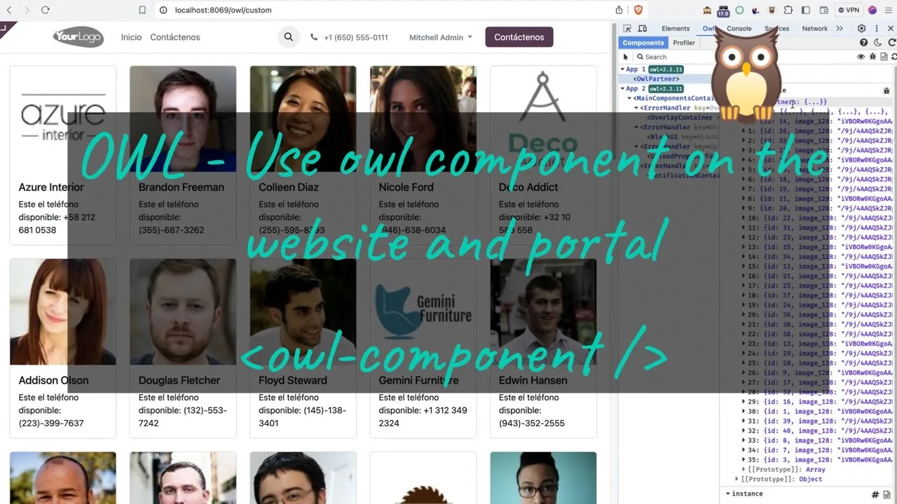
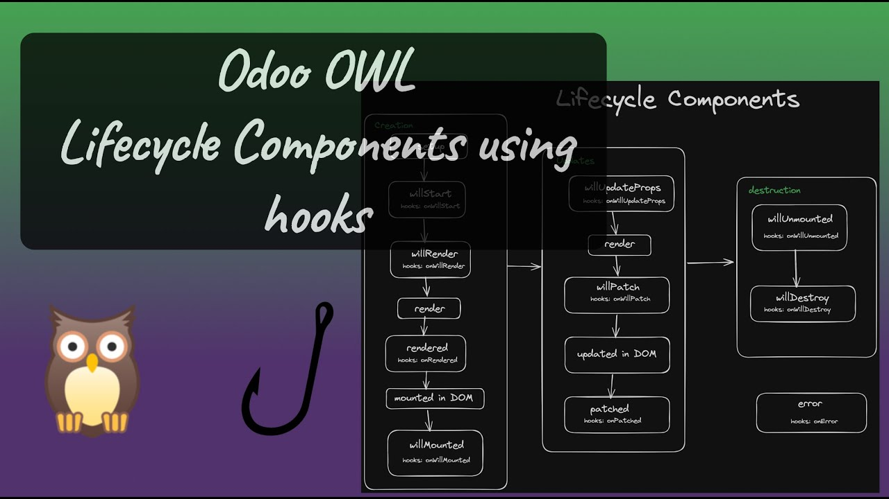
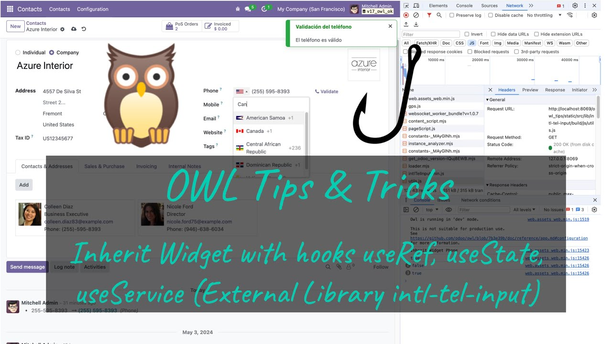
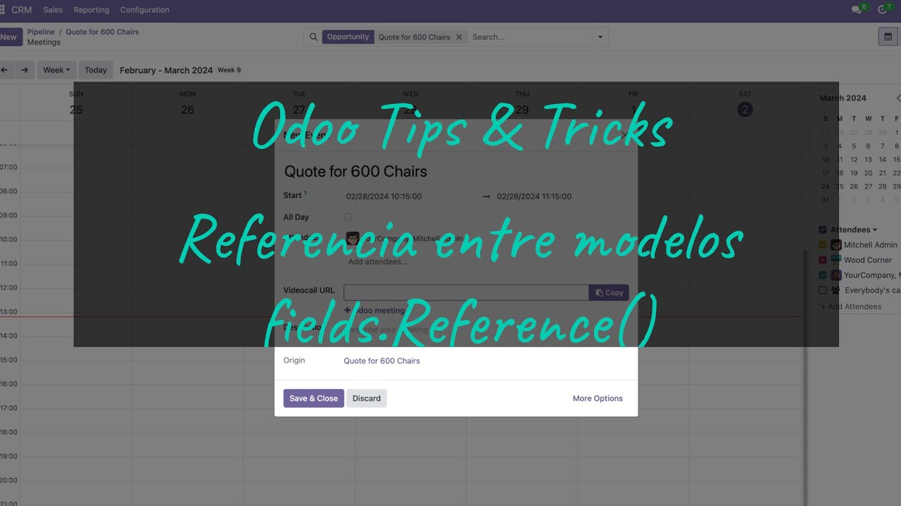

# Devtoolschool Addons

## Addons descriptions

- `owl_website`: Use Owl components on the portal and website. (fields.Reference) 

-`owl_lifecycle_component`: Lifecycle Components using hooks 

- `owl_intl_phone_field`:  Inherit Widget used hooks (useRef, useState, useService) and External Library 

- `calendar_origin_ref`: Reference between models (fields.Reference) 
